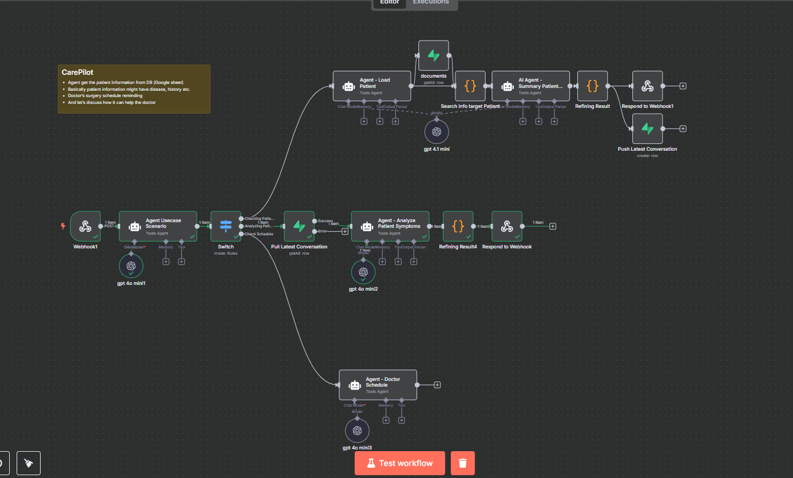
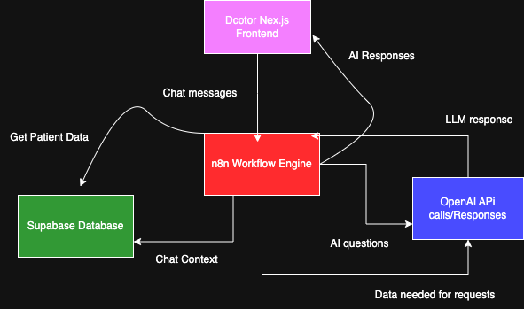

# CarePilot - AI Voice-Enabled Doctor Assistant

<div align="center">
  
  
  **CarePilot = More Time. Better Care. Scalable Impact.**
</div>

## 🩺 The Problem

Healthcare professionals face unprecedented administrative burdens:

- **📄 Heavy paperwork** that consumes valuable time
- **📝 Manual data entry** that slows down workflow  
- **✏️ Real-time note-taking** during consultations that splits focus

> *"Doctors spend up to **50% of their time** on documentation."*

## 🚀 The Solution

CarePilot is an AI-powered voice assistant designed to transform healthcare workflows. What if doctors could spend more time on **patient care**, not **paperwork**?

### ✨ Key Features

#### 📋 Instant Patient Summaries
Cuts through medical history clutter to deliver concise, actionable insights that help doctors make informed decisions quickly.

#### 🎤 Voice-to-Structured Notes + Smart Prompts  
Turns conversations into clinical notes and triggers AI-recommended next steps, eliminating manual documentation burden.

#### 📅 Real-Time Schedule Integration
Seamlessly manages calendars and patient appointments, reducing workflow friction and administrative overhead.

#### 🤖 Voice-Driven Automation
Handles routine tasks — saving time, reducing burnout, and boosting efficiency for healthcare professionals.

## 🛠️ Tech Stack

- **Frontend**: Next.js 15.1.8 with TypeScript
- **Styling**: CSS-in-JS with responsive design
- **Voice Recognition**: Web Speech API
- **AI Integration**: N8N webhook integration
- **Deployment**: Vercel-ready

### 🔧 N8N Workflow Integration

Our CarePilot system leverages N8N for seamless AI workflow automation:

<div align="center">
  
  <p><em>N8N workflow powering CarePilot's AI backend integration</em></p>
</div>

## 🏛️ System Architecture

CarePilot's architecture is designed for scalability, reliability, and seamless integration:

<div align="center">
  
  <p><em>Complete system architecture showing data flow and component interactions</em></p>
</div>

### Key Architecture Components:
- **Frontend Layer**: Next.js application with voice recognition
- **API Gateway**: N8N workflow orchestration 
- **AI Processing**: Large Language Model integration
- **Data Layer**: Patient information management
- **Security Layer**: HIPAA-compliant data handling

## 🏗️ Project Structure

```
CarePilot/
├── app/
│   ├── page.tsx          # Landing page with project overview
│   ├── demo/
│   │   └── page.tsx      # Interactive CarePilot demo
│   ├── layout.tsx        # Root layout
│   └── globals.css       # Global styles
├── public/
│   └── CarePilotLogo.png # Project logo
└── README.md
```

## 🚀 Getting Started

### Prerequisites

- Node.js 18+ 
- npm, yarn, pnpm, or bun

### Installation

1. Clone the repository:
```bash
git clone https://github.com/your-username/CarePilot.git
cd CarePilot
```

2. Install dependencies:
```bash
npm install
# or
yarn install
# or
pnpm install
```

3. Run the development server:
```bash
npm run dev
# or
yarn dev
# or
pnpm dev
```

4. Open [http://localhost:3000](http://localhost:3000) in your browser.

## 📱 Usage

### Landing Page (`/`)
- Project overview and problem statement
- Feature highlights
- Call-to-action for demo

### Demo Page (`/demo`)
- Interactive AI chat interface
- Voice recognition capabilities
- Doctor schedule simulation
- Real-time AI responses

## 🌟 Features

- **Responsive Design**: Works on desktop, tablet, and mobile
- **Voice Recognition**: Hands-free interaction using Web Speech API
- **Real-time Chat**: AI-powered responses via webhook integration
- **Modern UI/UX**: Gradient backgrounds, animations, and intuitive interface
- **Accessibility**: ARIA labels and keyboard navigation support

## 🔧 Configuration

### Environment Variables

Create a `.env.local` file in the root directory:

```env
NEXT_PUBLIC_WEBHOOK_URL=your_n8n_webhook_url
```

### Voice Recognition

The application automatically detects browser support for voice recognition:
- Chrome/Edge: Full support
- Firefox: Limited support  
- Safari: Requires user permission

## 📊 Performance

- **First Contentful Paint**: < 1.5s
- **Largest Contentful Paint**: < 2.5s
- **Cumulative Layout Shift**: < 0.1
- **Time to Interactive**: < 3s

## 🔒 Security & Compliance

- **HIPAA Compliant**: Designed with healthcare data protection in mind
- **Real-time Processing**: No persistent storage of sensitive data
- **Secure Communication**: HTTPS-only API endpoints

## 🤝 Contributing

1. Fork the repository
2. Create a feature branch (`git checkout -b feature/amazing-feature`)
3. Commit your changes (`git commit -m 'Add amazing feature'`)
4. Push to the branch (`git push origin feature/amazing-feature`)
5. Open a Pull Request

## 📄 License

This project is licensed under the MIT License - see the [LICENSE](LICENSE) file for details.

## 👥 Team

**CarePilot Team** - Transforming healthcare with innovative AI solutions

### Core Team Members:

- **Jun Song** - [LinkedIn](https://www.linkedin.com/in/junsong0602)
- **Atchuta Vani Munnamgi** - [LinkedIn](https://www.linkedin.com/in/atchuta-vani-munnamgi/)
- **Alvin Ishimwe** - [LinkedIn](https://www.linkedin.com/in/alvin-ishimwe/)
- **Alba [LinkedIn]

## 🔗 Links

- **Live Demo**: [CarePilot Youtube Demo](https://www.youtube.com/watch?v=6-lDsj1gmZM)
- **Documentation**: [Project Docs](https://docs.google.com/document/d/1EN2k-xsVjuNdmYFqnJBhVM_17AK1TxLRuR5yq9A1cl8/edit?tab=t.4s2y6ee8u1es)
- **AgentHacksg 2025**: [Hackathon](https://devpost.com/software/carepilot-ebjmna?_gl=1*1vlqpni*_gcl_au*NDA1MDM4NjE2LjE3NDgxMTM4ODI.*_ga*MjExNzc0MDMxMS4xNzQ4MTEzODgy*_ga_0YHJK3Y10M*czE3NDgxMzA5MzkkbzUkZzEkdDE3NDgxMzMwODIkajAkbDAkaDA.)

## 🆘 Support

For support, email support@carepilot.com or open an issue on GitHub.

---

*Built with ❤️ for healthcare professionals worldwide*
